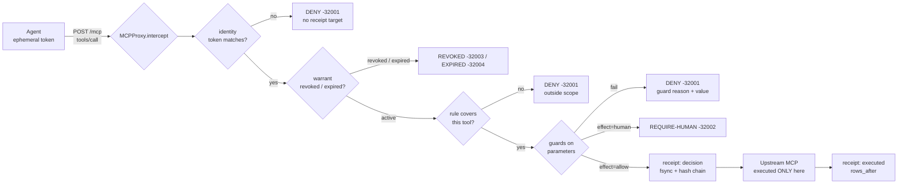

# Architecture — one node

The node is a *pre-execution gate*. Nothing passes to the downstream MCP server without a
decision, and every decision is recorded before the gate opens.



## The interception contract

`MCPProxy.intercept(agent, token, tool, params) -> (decision, reason, detail, receipt, executed)`

* `executed` is `True` only when `upstream.call(...)` was reached. Everything else is a
  refusal, and the upstream counter proves it.
* The receipt is written **before** the gate opens, so a crash between the two receipts
  leaves evidence that a call was authorised — never a silent execution.
* A revoked agent's identity is *not* deleted: it resolves to `halted`, so the next call
  returns `REVOKED` (an event) instead of `unknown agent` (a mystery).

## The warrant

```
payload = {id, agent, role, scope, ttl, rules, issuer, issued}
sig     = HMAC-SHA256(issuer_key, canon(payload))
```

* `canon` = sorted keys, no whitespace, UTF-8 preserved — the same record always hashes to
  the same bytes.
* TTL is checked on every call: an expired warrant is a decision, not a background job.
* Tokens are derived: `HMAC(key, "tok:<agent>:<warrant>")[:24]` — deterministic, bound to
  one agent and one warrant, never stored in the clear.

## The registry

```
entry.hash = sha256(prev_hash + canon(entry_without_hash))
entry.prev = prev_hash            # genesis = "0" * 64
```

Appended as one JSON line, then `flush()` + `fsync()`. `GET /verify` recomputes from
genesis: edit or delete any line and the chain breaks at that index.

## Configuration decisions

* Policy rules are declared in `warrnt/seed.py`, in code. An admin UI is a platform; this
  is one node. Changing the rules is how you change behaviour, and it is reviewable in git.
* The sandbox upstream counts executions instead of pretending to be a database, so "the
  export never ran" is a number, not a claim. Set `WARRNT_UPSTREAM` to front a real MCP
  server — the gate is identical.

## What this deliberately is not

No multi-tenancy, no stdio transport, no durable queue, no distributed ledger. Each of
those is a real thing to build *after* the single node is undeniable.
